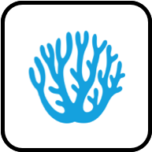
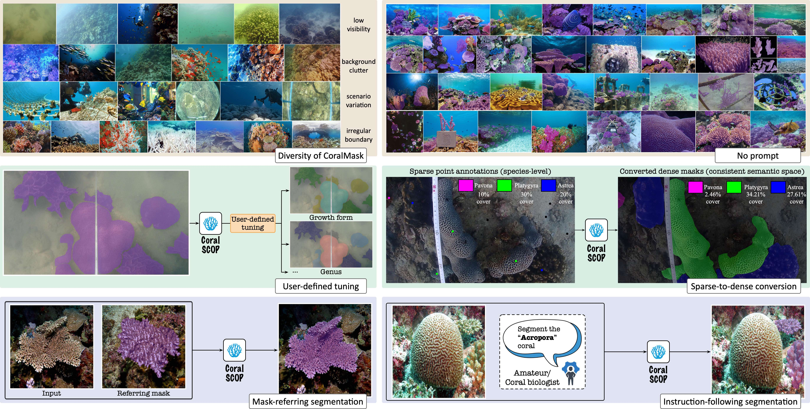
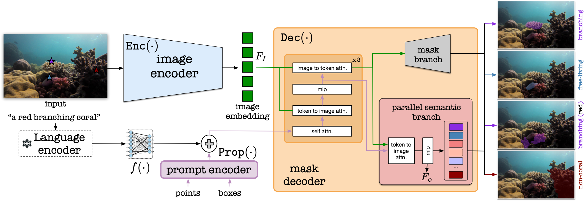
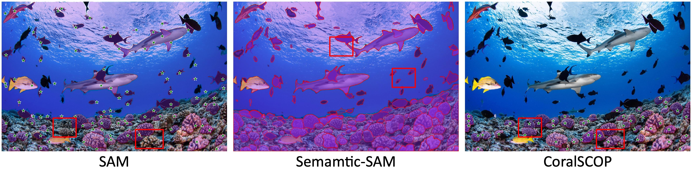
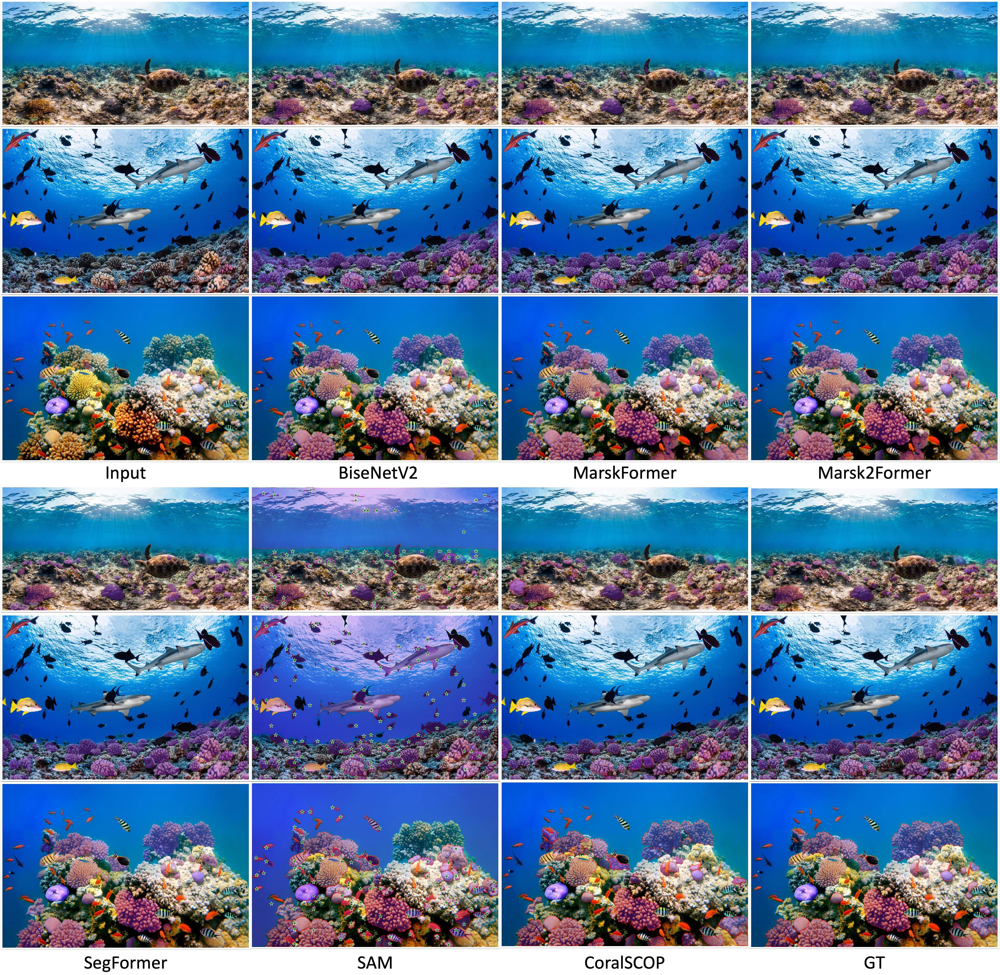
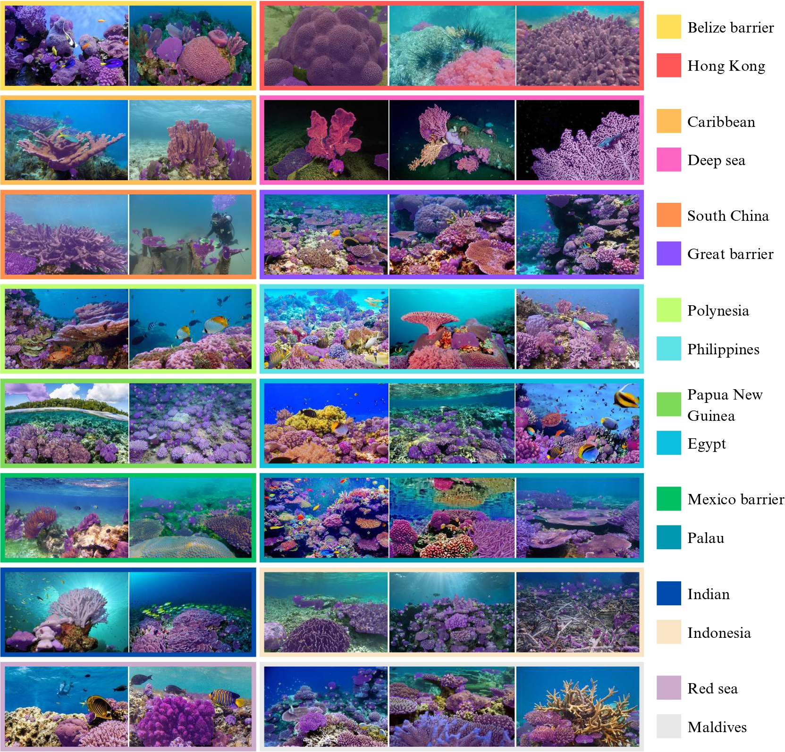

#  MarineInst: A Foundation Model for Marine Image Analysis with Instance Visual Description

<a href="https://coralscop.hkustvgd.com/"></a>

<a href="https://coralscop.hkustvgd.com/CoralSCOP_files/CoralSCOP__Segment_any_COral_Image_on_this_Planet.pdf">"></a>

Aninaugural foundation model proposed for dense coral segmentation. CoralSCOP could serve user-defined tuning and sparse-to-dense conversion to obtain more fine-grained, reliable and accurate coral statistics. The mask-referring segmentation and instruction-following segmentation enable both amateurs and coral biologists to generate coral masks.


[Ziqiang Zheng](https://zhengziqiang.github.io/), Haixin Liang, [Binh-Son Hua](https://sonhua.github.io/), [Yue Him Wong](https://scholar.google.com/citations?user=M5j3ZiQAAAAJ), Put ANG Jr, [Apple Pui Yi CHUI](https://scholar.google.com.hk/citations?user=z7mWGNwAAAAJ&hl=en), [Sai-Kit Yeung](https://saikit.org/) 

> - Primary contact: Ziqiang Zheng (zhengziqiang1@gmail.com)

## 📢 News

[Sep.28 2024] We released the testing codes and the pre-trained model of CoralSCOP. 

[Aug.12 2024] CoralSCOP was accepted by CVPR as a **Highlight**.


## Overview

<p align="center">
    </a> <br>
    Teaser of CoralSCOP.
</p>

Key Contributions:
* CoralSCOP - **First foundation model for coral reef segmentation**. 
* [CoralMask dataset](https://docs.google.com/forms/d/e/1FAIpQLSc8qHFBwhsJS_46hqS42NHN-3OqD5GSwvv4Sb36njdrb3LI7g/viewform) - A **Large-scale, Diverse, Comprehensive** coral reef dataset with human labeled coral reef masks.
* Support various coral reef analytical requirements: `dense coral population computation`, `coral distribution statistics`, `user-defined coral density computation`, `bleached coral analysis` and `3D coral reef reconstruction`.

Insights:
* Parallel semantic branch - We design a novel **parallel semantic branch** at the decoder, which effectively addresses the semantic-agnostic issue as well as enables new training strategies for further enhanced results.
* Train with negatives - We propose a new training with negatives strategy to alleviate the false positives due to the extreme ratio between pre-training data and fine-tuning data.
* Promptable reef segmentation. - CoralSCOP can also receive various kinds of prompts (e.g., points, boxes and texts) to guide the generation of semantic coral masks based on user intents.


## Abstract
Underwater visual understanding has recently gained increasing attention within the computer vision community for studying and monitoring underwater ecosystems. 
Among these, coral reefs play an important and intricate role, often referred to as the rainforests of the sea, due to their rich biodiversity and crucial environmental impact. 
Existing coral analysis, due to its technical complexity, requires significant manual work from coral biologists, therefore hindering scalable and comprehensive studies. 
In this paper, we introduce CoralSCOP, the first foundation model designed for the automatic dense segmentation of coral reefs. 
**CoralSCOP** is developed to accurately assign labels to different coral entities, addressing the challenges in the semantic analysis of coral imagery. 
Its main objective is to identify and delineate the irregular boundaries between various coral individuals across different granularities, such as coral/non-coral, growth form, and genus. 
This task is challenging due to the semantic agnostic nature or fixed limited semantic categories of previous generic segmentation methods, which fail to adequately capture the complex characteristics of coral structures. 
By introducing a novel parallel semantic branch, CoralSCOP can produce high-quality coral masks with semantics that enable a wide range of downstream coral reef analysis tasks. We demonstrate that CoralSCOP exhibits a strong zero-shot ability to segment unseen coral images. 
To effectively train our foundation model, we propose CoralMask, a new dataset with 41,297 densely labeled coral images and 330,144 coral masks. 
We have conducted comprehensive and extensive experiments to demonstrate the advantages of CoralSCOP over existing generalist segmentation algorithms and coral reef analytical approaches.

## Framework

<p align="center">
    </a> <br>
    The proposed CoralSCOP framework. We design a parallel semantic branch inside the mask decoder, enabling the coral mask generation with semantics. The whole model is trainable in the pre-training procedure and Enc(·) is frozen in the tuning procedure.
    We provide the detailed of our CoralSCOP under the pre-training procedure; user-defined tuning procedure; and instruction-following tuning procedure.
</p>

> * Pre-training. During the pre-training procedure, 1.3 million masks are utilized for training our CoralSCOP. We optimize the parameters of the whole model during the pre-training procedure to promote Enc(·) to extract underwater visual features. The composite prompts of point prompts and bounding box prompts are utilized for training.
> * User-defined tuning. For the user-defined tuning, the coral masks with corresponding user-defined semantic annotations are fed into CoralSCOP and we only optimize the MLP layer in Dec(·). The users could self-design the label of generated coral masks, ensuring the flexibility of the proposed CoralSCOP for downstream coral reef analysis tasks.
> * Instruction-following tuning. For the instruction-following tuning, we borrow the language decoder of CLIP to generate the textual embedding to empower CoralSCOP with the ability to understand the user intents. For coral mask generation, we only label the corals belonging to the given coral species when there are multiple coral species. The generated sentences are paired with the labeled images to formulate textual input and mask output pairs.

## Results

* Illustration of differences between SAM, Semantic-SAM and CoralSCOP.

<p align="center">
    </a> <br>
    CoralSCOP could effectively address over-segmentation  and generate more accurate coral masks than SAM and Semantic-SAM.
</p>

* Comparison with different algorithms, including specialist and generalist segmentation models.

<p align="center">
    </a> <br>
    The coral segmentation comparisons between various algorithms. Both SAM and CoralSCOP could separate dissimilar corals into different coral masks while others failed.
</p>

* Zero-shot coral reef segmentation on unseen coral reef images.

<p align="center">
    </a> <br>
    The zero-shot coral reef segmentation results of CoralSCOP on unseen coral reef images.
</p>

* Generalization ability to coral reef images from various sites.

<p align="center">
    </a> <br>
    The automatic coral segmentation of CoralSCOP on coral reef images from different sites.
</p>

* Comparison with SAM on various coral reef images.

<p align="center">
    </a> <br>
    We report the qualitative coral reef segmentation result comparison between SAM and CoralSCOP. CoralSCOP could effectively alleviate the false positives and false negatives. 
</p>


## Getting Started
### Installation

**1. Prepare the codes and the environment**

Git clone our repository, creating a python environment and activate it via the following commands:

```bash
git clone https://github.com/zhengziqiang/CoralSCOP
cd CoralSCOP
conda env create -f coral.yaml
conda activate coralscop
```


**2. Download the pre-trained weights**

We provide the trained [CoralSCOP model](https://www.dropbox.com/scl/fi/pw5jiq9oc8e8kvkx1fdk0/vit_b_coralscop.pth?rlkey=qczdohnzxwgwoadpzeht0lim2&st=actcedwy&dl=0) (ViT-B backbone) for users to generate the coral reef masks based on their own coral reef images. Please download the model and put it at `checkpoints`.


**3. Testing and visualization**

Testing the model based on your own coral reef images. The outputs will be saved in JSON format (COCO RLE). Please specify the output folder:

```
python test.py --model_type vit_b --checkpoint_path ./checkpoints/vit_b_coralscop.pth --iou_threshold 0.72 --sta_threshold 0.62 --test_img_path ./demo_imgs/ --output_path ./demo_imgs_output --gpu 0 --point_number 32
```

`model_type` indicates the backbone type; `checkpoint_path`: model checkpoint path, please change to your path; `iou_threshold`: predict iou threshhold, masks with predicted iou lower than 0.72 will be removed;`sta_threshold`: stability score threshhold, masks with stability score lower than 0.62 will be removed; `test_img_path`: your testing image path; `output_dir`: output path for saving the generated jsons; `gpu`: which gpu to use.
   
Visualize the generated jsons :

```
python coralscop_visualization.py --img_path ./demo_imgs/ --json_path ./demo_imgs_output/ --output_path ./vis_demo 
```
`img_path`: same as the `test_img_path`, the testing images; `json_path`: same sa the `output_dir`, the path for saving generated json; `output_path`: the path for saving the images with visualizations. 


### Training

**1. Datasets**

Please download the official [CoralMask dataset](https://docs.google.com/forms/d/e/1FAIpQLSc8qHFBwhsJS_46hqS42NHN-3OqD5GSwvv4Sb36njdrb3LI7g/viewform). Due to copyright issues, we remove some coral reef images with copyright issues. Now the whole CoralMask dataset contains `39,023` coral reef images with `299,969` coral reef masks.


## Updates:
- [x] Project page
- [x] Dataset release
- [x] Pre-trained model and testing codes release
- [ ] Offline labeling tool based on CoralSCOP
- [ ] Training codes release

## Acknowledgement

+ [SAM](https://github.com/facebookresearch/segment-anything) Thanks for their contributions to the whole community! It is really a great work.
+ [PLAS](https://github.com/sgraine/point-label-aware-superpixels) We use PLAS for sparse-to-dense conversion.
+ [CoralNet](https://coralnet.ucsd.edu/) Semi-automatic coral reef analysis platform.

##  Citing CoralSCOP

If you find CoralSCOP helpful, please consider citing:
```
@inproceedings{ziqiang2024coralscop,
    title={Coral{SCOP}: Segment any {CO}ral Image on this Planet},
    author={Ziqiang Zheng and Haixin Liang and Binh-Son Hua and Yue Him Wong and Put ANG Jr and Apple Pui Yi CHUI and Sai-Kit Yeung},
    booktitle={IEEE/CVF conference on Computer Vision and Pattern Recognition (CVPR)},
    year={2024},
}
```

We also encourage to cite these following valuable works:

```
@article{beijbom2015towards,
  title={Towards automated annotation of benthic survey images: Variability of human experts and operational modes of automation},
  author={Beijbom, Oscar and Edmunds, Peter J and Roelfsema, Chris and Smith, Jennifer and Kline, David I and Neal, Benjamin P and Dunlap, Matthew J and Moriarty, Vincent and Fan, Tung-Yung and Tan, Chih-Jui and others},
  journal={PloS one},
  year={2015},
  publisher={Public Library of Science San Francisco}
}
@inproceedings{alonso2018semantic,
  title={Semantic segmentation from sparse labeling using multi-level superpixels},
  author={Alonso, I{\~n}igo and Murillo, Ana C},
  booktitle={IEEE/RSJ International Conference on Intelligent Robots and Systems (IROS)},
  pages={5785--5792},
  year={2018},
  organization={IEEE}
}
@article{kirillov2023segment,
  title={Segment anything},
  author={Kirillov, Alexander and Mintun, Eric and Ravi, Nikhila and Mao, Hanzi and Rolland, Chloe and Gustafson, Laura and Xiao, Tete and Whitehead, Spencer and Berg, Alexander C and Lo, Wan-Yen and others},
  journal={IEEE/CVF International Conference on Computer Vision (ICCV)},
  year={2023}
}
@article{raine2022point,
  title={Point Label Aware Superpixels for Multi-species Segmentation of Underwater Imagery},
  author={Raine, Scarlett and Marchant, Ross and Kusy, Brano and Maire, Frederic and Fischer, Tobias},
  journal={IEEE Robotics and Automation Letters (RA-L)},
  year={2022}
}
```

## Acknowledgement

We sincerely thank Thomas, Yiheng Feng, Ruojing Zhou, Han Liu, Suzhen Fan, Maijia Li, Yuwen Zhang, Shou Zou, Yupei Chen, Yaofeng Xie, Jia Li and Kai Chen for their help on data collection and processing. Without their efforts, we cannot finish this project on time.
